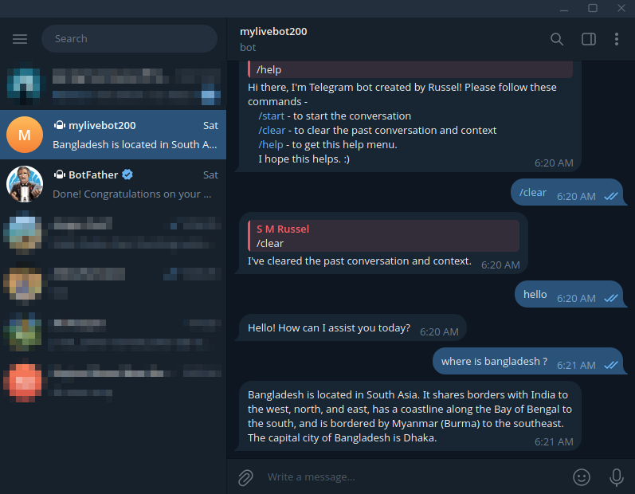

# Telegram Bot with OpenAI API Integration

## Description  
This project is a Telegram bot powered by the OpenAI API, enabling users to interact with AI-driven responses directly within Telegram. It provides intelligent conversational capabilities, answering questions, generating text, and assisting with various tasks. Designed for developers, businesses, and individuals looking to automate responses or enhance engagement through AI-powered chat.  

## Dependencies
- Python 3.7  

## Setup Instructions  
Before running the application, create a `.env` file from `.env.sample` and add the required credentials:  

OPENAI_API_KEY=your_openai_api_key 

TELEGRAM_BOT_TOKEN=your_telegram_bot_token


## Run Locally

Clone the project

```bash
  git clone https://github.com/smrussel/telegram-openai.git
```

Go to the project directory

```bash
  cd telegram-openai/
```

Install dependencies

```bash
  pip install -r requirements.txt
```

Start the server

```bash
  python main.py
```

## Bot Screenshot



